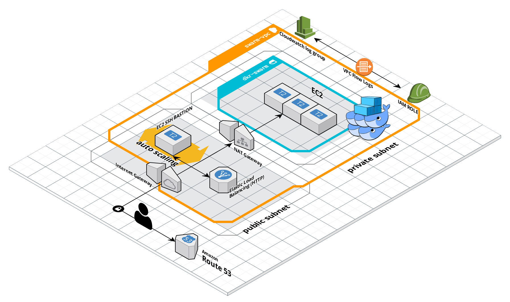
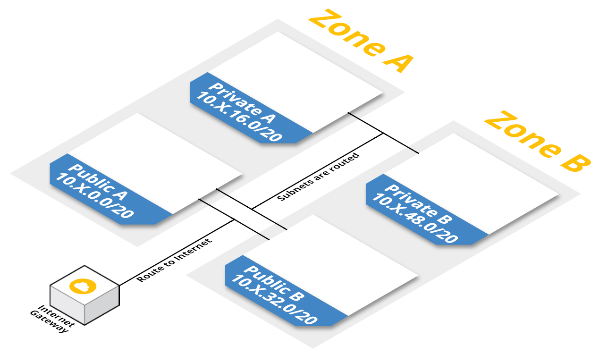
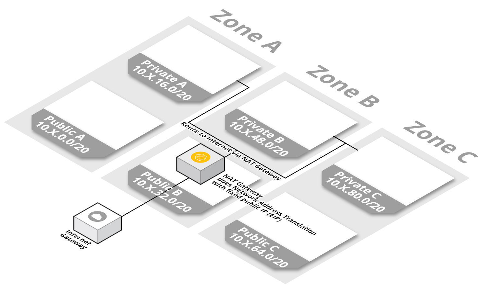

# AWS Docker Swarm Cluster Setup Script

## THIS IS AN EXERCISE, DO NOT USE, USE TERRAFORM INSTEAD!

This bash script provisions a fixed size docker swarm cluster using [EC2](https://aws.amazon.com/ec2) in [AWS](https://aws.amazon.com/).

It uses [bash](https://en.wikibooks.org/wiki/Bash_Shell_Scripting) scripts, [AWS CLI](https://aws.amazon.com/documentation/cli/), [JQ](https://stedolan.github.io/jq/manual/) and [Ansible](https://docs.ansible.com/ansible/latest/index.html) (to init the swarm cluster inside the vm's)

## Pre-run steps

* Create [IAM User and API key](https://docs.aws.amazon.com/IAM/latest/UserGuide/id.html)
* Create ssh key pair `aws ec2 create-key-pair --key-name <value> --output text > private_key1.pem`
* Generate pubkey from private key `ssh-keygen -y -f private_key1.pem > public_key1.pub `
* Create a [AWS Route 53 Hosted Zone](https://docs.aws.amazon.com/Route53/latest/DeveloperGuide/CreatingHostedZone.html)

## Docker Wrapper Quick Start

### Requirements

* bash
* docker
* make

### Steps

* Create file called `aws-variables.properties` in project's root dir, use reference values from `template/aws-variables.properties` according to your project's parameters
* Export `AWS_KEY_ID` and `AWS_SECRET_KEY` variables
* Run `make build`
* Run `make dkrun`
* Seat back and relax ☕ (:

## Host Execution Quick Start

### Requirements

* bash 3.2
* python 2.7
* ansible 2.x
* pip
* aws cli
* awk
* dos2unix
* jq
* openssl
* docker-py
* boto

### Steps

* Create API keys access in IAM with permissive policy
* Create file called `password.properties` in project's root dir and supply with `AWS_KEY_ID` and `AWS_SECRET_KEY` variables
* Create file called `aws-variables.properties` in project's root dir use reference values from `template/aws-variables.properties` according to your project
* Run `./create-ec2-swarm-cluster.sh`
* Seat back and relax ☕ (:

## Full Infrastructure Architecture

## Detailed solution

Some blueprints to explain the provision setup

### VPC setup with Cloudformation template

This VPC is distributed in two availability zones each one with a private subnet and a public one and an internet gateway that provides internet access to the public subnet.

This setup is provided by [this Cloudformation template](https://github.com/widdix/aws-cf-templates/blob/master/vpc/vpc-2azs.yaml) under [Apache License, Version 2.0](https://www.apache.org/licenses/LICENSE-2.0)

### VPC NAT Gateway

The [NAT Gateway](https://docs.aws.amazon.com/pt_br/AmazonVPC/latest/UserGuide/vpc-nat-gateway.html) allows instances placed in a private subnet to access the internet.

This setup is provided by [this Cloudformation template](https://github.com/widdix/aws-cf-templates/blob/master/vpc/vpc-nat-gateway.yaml) under [Apache License, Version 2.0](https://www.apache.org/licenses/LICENSE-2.0)

### EC2 SSH Bastion Server

The [SSH Bastion Linux Server](https://docs.aws.amazon.com/quickstart/latest/linux-bastion/architecture.html) provide secure access to Linux instances located in the private and public subnets.

This setup is provided by [this Cloudformation template](https://github.com/widdix/aws-cf-templates/blob/master/vpc/vpc-ssh-bastion.yaml) under [Apache License, Version 2.0](https://www.apache.org/licenses/LICENSE-2.0)

## TODO

* Use Terraform which is unarguably a better solution then bash scripts to provision complex infrastructures in cloud environments
* Create an auto scaling group for Docker Swarm Workers
* Create a lambda function described in `rotate-ebs-snapshots.py` and configure the CloudWatch trigger for it at the end of the provisioning process, this will enable automatic backup rotation.

## Author

Rogério Castelo Branco Peixoto (rcbpeixoto@gmail.com)